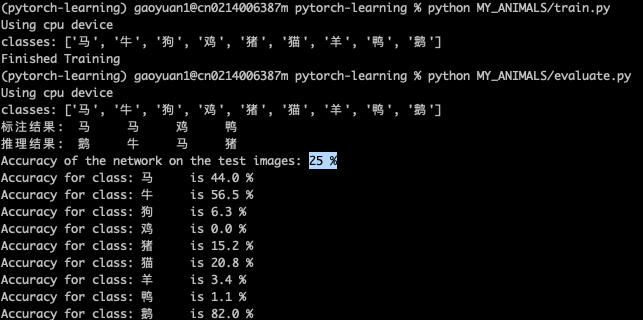
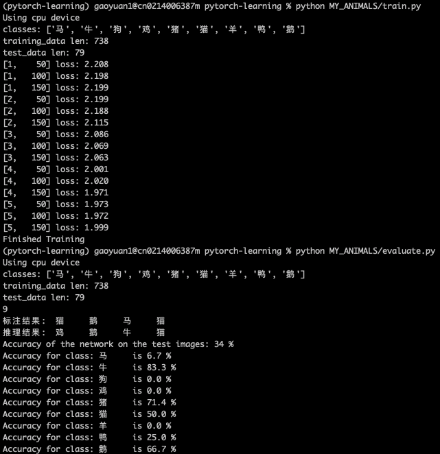

[TOC]

# 准备工作目录
```bash
# 获取当前示例代码
git clone https://github.com/aidezone/pytorch-learning.git

# 进入工作目录
cd pytorch-learning

# 创建数据目录
mkdir data
````


# 准备数据集

## 使用ImageDownloader

```bash
git clone https://github.com/aidezone/Image-Downloader

````

详细说明：https://github.com/aidezone/Image-Downloader/blob/master/README_zh.md


# 使用CIFAR10示例中定义好的网络


## 修改定义数据集部分

```python

# 定义数据集
from torch.utils.data import Dataset
from PIL import Image
import os

class CustomImageDataset(Dataset):
    def __init__(self, classes, offset, limit, img_dir, transform=None, target_transform=None):
        self.img_classes = classes
        # 从文件目录中直接加载标注信息，eg：./download_image/猫/0001.jpg   img_dir=./download_image  classes[i]=猫
        self.img_labels = []
        for i in range(0, len(classes)):
            # 拼接分类名称为一个完整的图片文件夹
            path_with_label = os.path.join(img_dir, classes[i])
            # 遍历每个分类文件夹下的图片
            for item in os.listdir(path_with_label):
                self.img_labels.append({
                    'file': os.path.join(classes[i], item), # img_dir之后的图片文件相对路径，eg：猫/0001.jpg
                    'label_index': i,
                    'label_name': classes[i],
                    })
        # 按输入的数量预期拆分数组
        self.img_labels = self.img_labels[offset:(offset+limit)]
        # 定义图片目录
        self.img_dir = img_dir
        # 定义transform，从后续的实验看出此部分是定义图片转换处理的，例如：toTensor、Resize
        self.transform = transform
        self.target_transform = target_transform

    def __len__(self):
        return len(self.img_labels) - 1

    def __getitem__(self, idx):
        # 拼接图片完整路径
        img_path = os.path.join(self.img_dir, self.img_labels[idx]["file"])
        # print(img_path)
        # 读取一张图片,抓取失败的图片可能是单通道的，此处强转一下
        image = Image.open(img_path).convert("RGB")
        # channels = len(image.split())
        # print(channels)
        # 读取图片对应的标签
        label = self.img_labels[idx]["label_index"]
        if self.transform:
            image = self.transform(image)
        if self.target_transform:
            label = self.target_transform(label)
        return image, label

```


## 修改loader

*一定要注意，此处在transform中添加了resize*
```python
# 使用Loader加载自定义数据集
import torchvision.transforms as transforms
from torch.utils.data import DataLoader
import json

transform = transforms.Compose(
    [transforms.Resize((32, 32)),  #将图片resize到与网络输入要求匹配的32*32的大小。
     transforms.ToTensor(),
     # transforms.Lambda(lambda x: x.repeat(3,1,1)),
     transforms.Normalize((0.5, 0.5, 0.5), (0.5, 0.5, 0.5))])

# 图片地址
img_dir = "../Image-Downloader/download_images"
# label映射文件
label_dict = "./data/label_dict.json"
# 加载图片时的batch_size
batch_size = 4
# 预定义label变量
classes = []

# 遍历文件夹，按顺序给出labeldict
for item in os.listdir(img_dir):
    if os.path.isdir(os.path.join(img_dir, item)):
        classes.append(item)

print(f'classes: {classes}')

# # 实例化训练集、测试
training_data = CustomImageDataset(classes, 0, 80, img_dir, transform=transform)
test_data = CustomImageDataset(classes, 80, 2000, img_dir, transform=transform)

print('training_data len: ' + str(len(training_data)))
print('test_data len: ' + str(len(test_data)))


# 实例化加载器
trainloader = DataLoader(training_data, batch_size=batch_size, shuffle=True)
testloader = DataLoader(test_data, batch_size=batch_size, shuffle=True)

```

## 训练并测试模型

```bash

python MY_ANIMALS/train.py

python MY_ANIMALS/evaluate.py

```

*得到的精度只有25%*，因为抓取下来的图片比较大，猜想可能有resize的原因、网络本身的原因等。




# 更换一个网络

## 网络和图片的说明

需要理解的几个关键点：
1. 不同网络定义对图片输入尺寸的要求不同。
2. 尺寸不可以随意更改，需要根据不同层输入计算出每一层网络的张量大小
3. 一般的网络都包括：卷积层、池化层、全连接层
4. 也可以通过改变网络的层定义来解决固定尺寸的问题

相关文章：
* [卷积神经网络里输入图像大小何时是固定，何时是任意？](https://www.zhihu.com/question/56688854)
* [卷积神经网络(CNN)张量(图像)的尺寸和参数计算](https://www.cnblogs.com/touch-skyer/p/9150039.html)
* [pytorch官网定义model的教程](https://pytorch.org/tutorials/beginner/introyt/modelsyt_tutorial.html)

*网络不是随便定义就可以work的，从工程开发的角度，我个人不会去做深入的研究，直接选择大神们实现好的网络使用*

## 选择AlexNet重新训练

源自：OpenMMLab
ResNet：https://github.com/open-mmlab/mmclassification/blob/master/mmcls/models/backbones/resnet.py
AlexNet: https://github.com/open-mmlab/mmclassification/blob/master/mmcls/models/backbones/alexnet.py
AlexNet: AlexNet--CNN经典网络模型详解（pytorch实现） https://blog.csdn.net/weixin_44023658/article/details/105798326

## 重新定义Transform

```python

# 重新定义数据加载
import torchvision.transforms as transforms
from torch.utils.data import DataLoader
import json

transform = transforms.Compose(
    [transforms.Resize((224, 224)),  #将图片resize到与Alex网络输入要求匹配的224*224的大小。
     transforms.ToTensor(),
     # transforms.Lambda(lambda x: x.repeat(3,1,1)),
     transforms.Normalize((0.5, 0.5, 0.5), (0.5, 0.5, 0.5))])

# 图片地址
img_dir = "../Image-Downloader/download_images"
# label映射文件
label_dict = "./data/label_dict.json"
# 加载图片时的batch_size
batch_size = 4
# 预定义label变量
classes = []

# 遍历文件夹，按顺序给出labeldict
for item in os.listdir(img_dir):
    if os.path.isdir(os.path.join(img_dir, item)):
        classes.append(item)

print(f'classes: {classes}')

# # 实例化训练集、测试
test_data = CustomImageDataset(classes, 0, 80, img_dir, transform=transform)
training_data = CustomImageDataset(classes, 80, 2000, img_dir, transform=transform)

print('training_data len: ' + str(len(training_data)))
print('test_data len: ' + str(len(test_data)))


# 实例化加载器
trainloader = DataLoader(training_data, batch_size=batch_size, shuffle=True)
testloader = DataLoader(test_data, batch_size=batch_size, shuffle=True)

```

## 训练结果



从结果来看精度略有提升，当前训练设备是cpu，训练速度较慢，迭代次数较少，也可能因为网络比较简单。后续的例子将使用更多开源训练工具来完成训练。


