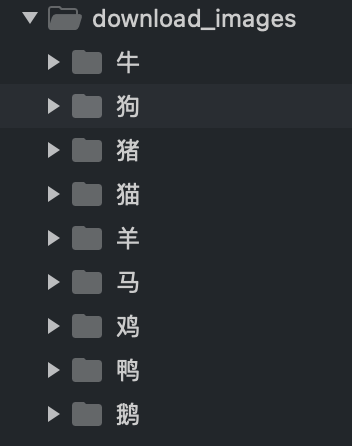

[TOC]


# 安装训练环境

## 建议先安装一个Conda或者Docker

为了学习工作时多个不同依赖环境的管理，建议安装一个Conda，参考：https://docs.conda.io/en/latest/miniconda.html#installing
如果您对docker非常熟悉，也可以直接用docker，参考：https://hub.docker.com/r/bitnami/pytorch


## 以conda为例创建开发环境

参考原文：https://pytorch.org/get-started/locally/#mac-anaconda

```bash
# 创建一个新的conda环境(一定要注意带python=3.7，版本太高容易出现pip库的版本依赖问题)
conda create -n pytorch-learning python=3.7

# 进入新创建的环境
conda activate pytorch-learning


# 安装pytorch、torchvisin、numpy、matplotlib
conda install pytorch torchvision numpy matplotlib


# 当然也可以使用pip安装
# 检查一下pip是否在当前新创建的conda环境中
which pip

# 注意pip中叫torch不叫pytorch。。。
pip install torch torchvision numpy matplotlib

# 如果速度慢可以使用国内源，添加参数：-i https://pypi.tuna.tsinghua.edu.cn/simple
# 清华源镜像站： https://mirrors.tuna.tsinghua.edu.cn/help/pypi/
# pip install -i https://pypi.tuna.tsinghua.edu.cn/simple  torch torchvision numpy matplotlib 


````

## 训练一个简单的分类器（CIFAR10）

当前示例主要以CIFAR10开源数据集为例，主要学习以下内容：
1. 将开源数据集还原成可视化图片，并生成标注描述文件
2. 自定义数据集和数据加载器。（此处不使用官方定义好的开源数据集读取库）
3. 定义一个简单网络并训练产出模型
4. 评测模型精度

更多：https://github.com/aidezone/pytorch-learning/blob/main/CIFAR10/README.md


## 训练一个动物识别模型

当前示例会从百度抓取图片，并构建一个新的数据集，主要内容：
1. 根据目录加载图片直接训练。（对于分类问题可以减少打标签标注的工作）
2. 不同大小的图片输入训练。
3. 使用开源实现的网络结构。
4. 使用第三方工具可视化推理结果和标注结果

下载图片工具：https://github.com/sczhengyabin/Image-Downloader （ fork：https://github.com/aidezone/Image-Downloader ）

下载图片以动物名字命名文件夹：


更多：https://github.com/aidezone/pytorch-learning/blob/main/MY_ANIMALS/README.md


## 使用开源训练工具库（lighting-flash）

ongoing...


